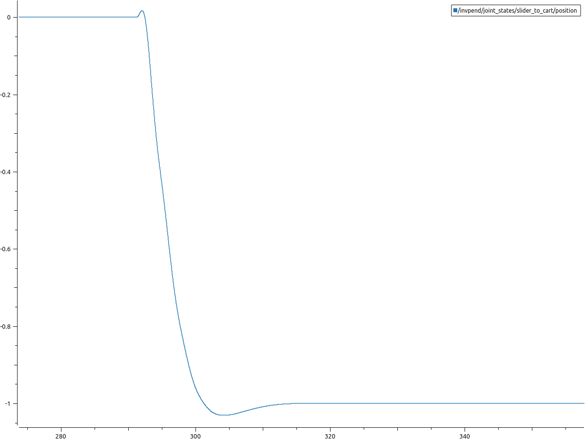
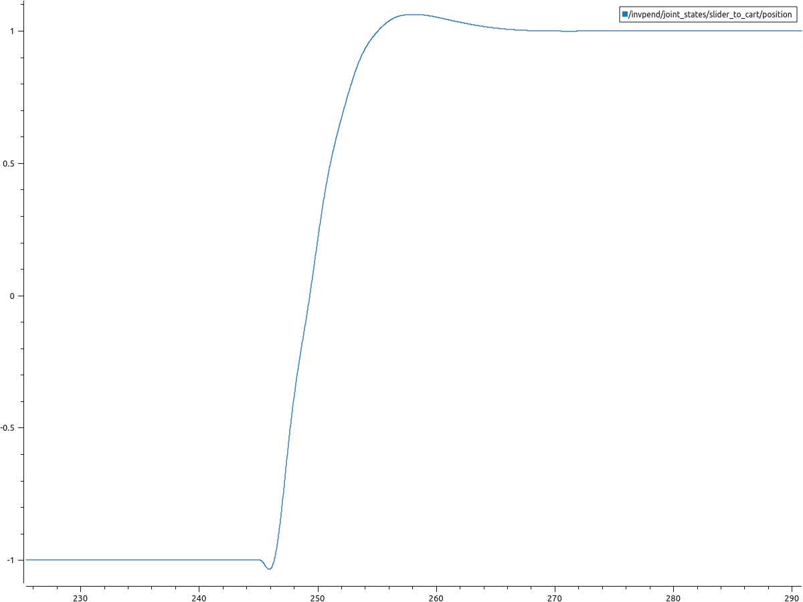

# CartPole
LQR Control for https://github.com/linZHank/invpend_experiment

 
Specify desired position of cart here  

`self.desired_state = np.matrix([[1],[0],[0],[0]])`

To execute `rosrun invpend_control lqr_controller.py`

## Plots
Setpoint: (pos, pos_dot, theta, theta_dot)

Setpoint: (-1,0,0,0)

Setpoint: (1,0,0,0)

## Video

